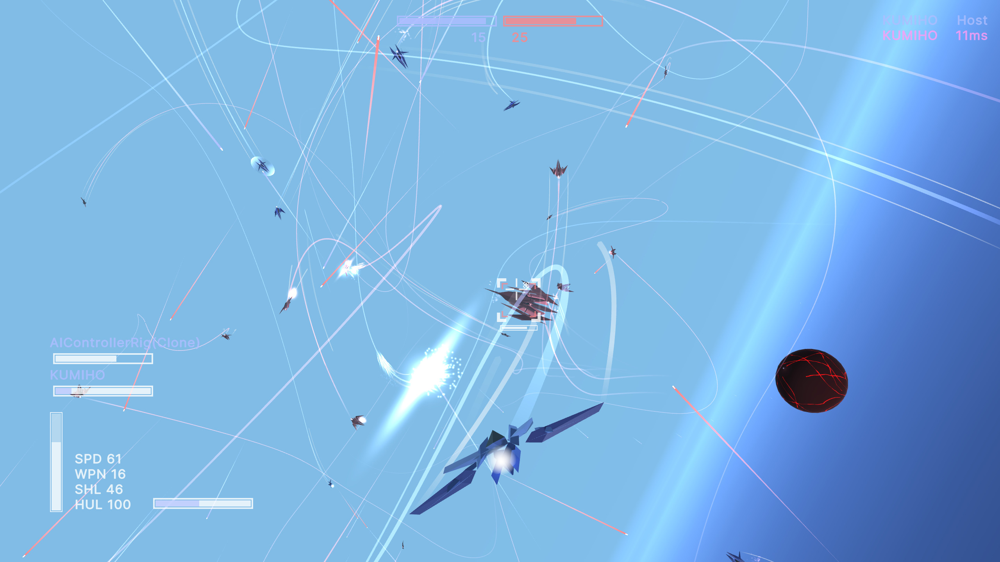

Hello!

This repository holds public builds for Flak, a WIP hobby space combat game. It is inspired by [its namesake Freelancer mod](https://www.moddb.com/mods/88-flak), and is intended to carry forward the general experience of that mod into a stand-alone game.

See [releases](https://github.com/Mech8/stuff/releases) for builds, or [this youtube playlist](https://www.youtube.com/playlist?list=PLWIUU_Dt60iHmDKsk8xqGayB1X-eDjGMB) for some (usually) Flak-related development videos.

Flak is developed entirely in free time on zero budget, with contributions and feedback from some pretty cool people.

It has a long way to go, but I love working on it and sharing its progress. Check it out!

~Alex "fox" Strout
